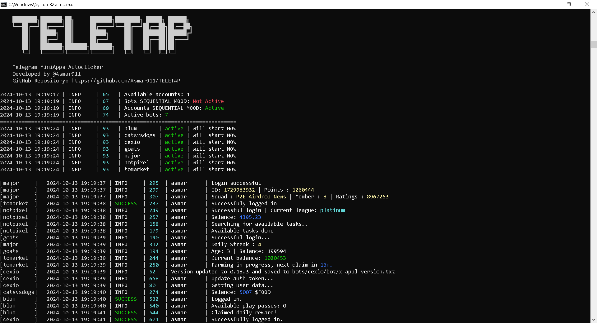

<h1 align="center">
  TELETAP
</h1>
<p align="center">
    Autoclicker for Telegram MiniApps
</p>

<!-- <p align="center">
  <a href="">EN</a> 
  | <a href="">RU</a> 
  | <a href="">AR</a> 
  | <a href="">TR</a> 
  | <a href="">FR</a>
</p> -->

<p align="center">
    <a href="https://t.me/Asmar911">
    </a>
    <a href="https://t.me/TELETAPBOTS">
    </a>
    <a href="https://t.me/TELETAPBOTSCHAT">
    </a>
</p>



<!-- ---
>[!Info]
>**This repo contains the free version of this software.**
>**Connected bots:** <a href="">Blum</a>, <a href="">Goats</a>, <a href="">Major</a>, <a href="">Notpixel</a>
>For the full version contact me <a href="https://t.me/Asmar911"> **@asmar911**</a> -->


<p align="center">
  <h2 align="center">Supported Bots ✅</h2>

  <p align="center">
    <a href='https://t.me/blum/app?startapp=ref_P4Rbg063KM'>Blum</a>
    | <a href='https://t.me/catsdogs_game_bot/join?startapp=153623395'>CatsVSDogs</a>
    | <a href='https://t.me/cexio_tap_bot?start=1716712060572190'>CEXIO</a>
    | <a href='https://t.me/realgoats_bot/run?startapp=68bd4bd3-172c-4f22-aa90-e092517e12b5'>GOATS</a>
    | <a href='https://t.me/major/start?startapp=153623395'>Major</a>
    | <a href='https://t.me/notpixel/app?startapp=f153623395'>Not Pixel</a>
    | <a href='https://t.me/Tomarket_ai_bot/app?startapp=0000omgl'>Tomarket</a>
  </p>


  <h2 align="center">Coming Soon ⏳</h2>

  <p align="center">
    <a href='http://t.me/token1win_bot/start?startapp=refId1254614970'>1Win Token</a>
    | <a href='https://t.me/BitsTonboxBot/BitsAirdrops?startapp=EJLsu9TTBuiazC93NnbaNz'>Bits</a>
    | <a href='https://t.me/boinker_bot/boinkapp?startapp=boink153623395'>Boinkers</a>
    | <a href='https://t.me/bums/app?startapp=ref_7tSfMieY'>Bums</a>
    | <a href='https://t.me/sparkscirclebot?start=ref2786541'>Circle</a>
    | <a href='https://t.me/cityholder/game?startapp=153623395'>City Holder</a>
    | <a href='https://t.me/BybitCoinsweeper_Bot?start=referredBy=153623395'>Coinsweeper</a>
    | <a href='https://t.me/coub/app?startapp=coub__marker_17772137'>Coub</a>
    | <a href='https://t.me/cryptorank_app_bot/points?startapp=ref_153623395_'>CryptoRank</a>
    | <a href='https://t.me/dotcoin_bot?start=r_153623395'>Dotcoin</a>
    | <a href='https://fintop.io/2wX1Q6R3RA'>Fintopio</a>
    | <a href='https://t.me/fabrika/app?startapp=ref_487203'>Friends Factory</a>
    | <a href='https://t.me/HexacoinBot/wallet?startapp=153623395'>Hexacore</a>
    | <a href='https://t.me/hexn_bot/app?startapp=eed6c6c0-7ccd-42fa-bb4e-4cff50aa4299'>HEXNIO</a>
    | <a href='https://t.me/MatchQuestBot/start?startapp=19a4cfda883b0d282c43e3be0d069adb'>MatchQuest</a>
    | <a href='https://t.me/memefi_coin_bot/main?startapp=r_74aa47c992'>MEMEFI</a>
    | <a href='https://t.me/MemesLabBot/MemesLab?startapp=XXMILV'>Memes Lap</a>
    | <a href='https://t.me/MMproBump_bot?start=ref_153623395'>MMProBump</a>
    | <a href='https://t.me/NomisAppBot/app?startapp=ref_pXZmyEgF9C'>Nomis</a>
    | <a href='https://t.me/NotBoredPuppies_bot?start=r_153623395'>Not Bored Puppies</a>
    | <a href='https://t.me/OKX_official_bot/OKX_Racer?startapp=linkCode_93102758'>OKXRacer</a>
    | <a href='https://t.me/seed_coin_bot/app?startapp=153623395'>SEED</a>
    | <a href='https://t.me/Simple_Tap_Bot/app?startapp=1723961197775'>Simple Coin</a>
    | <a href='https://t.me/TimeFarmCryptoBot?start=1eYFkqTqjduuyi4DN'>Time Farm</a>
    | <a href='https://t.me/tonstationgames_bot/app?startapp=ref_4sbbv2a964pxhhabk6wyjz'>Ton Station</a>
    | <a href='https://t.me/wcoin_tapbot?start=MTUzNjIzMzk1'>W-coin</a>
    | <a href='https://t.me/y_nation_bot/start?startapp=PBZW3D'>Y Nation</a>
    | <a href='https://t.me/theYescoin_bot/Yescoin?startapp=h3S05a'>Yescoin</a>
  </p>
</p>


## **Features**
- ✅ **Multithreading**
- ✅ **Accounts System**
- - ✅ **Proxy binding to session** (Account)
- - ✅ **User-Agent binding to session** (Account)
- ✅ **Support for tdata / pyrogram .session**
- ✅ **Registration in bots**
- ✅ **Auto-Referral**
- ✅ **Easy to use**
---


## Quick Start 📚

To fast install libraries and run bot - open `run.bat` on Windows or `run.sh` on Linux

## Prerequisites
Before you begin, make sure you have the following installed:
- [Python](https://www.python.org/downloads/) **version 3.10**

## Obtaining API Keys
1. Go to [my.telegram.org](https://my.telegram.org) and log in using your phone number.
2. Select "API development tools" and fill out the form to register a new application.
3. Record the API_ID and API_HASH provided after registering your application in the .env file.

## Installation
You can download the [**repository**](https://github.com/Asmar911/TELETAP) by cloning it to your system and installing the necessary dependencies:
```shell
git clone https://github.com/Asmar911/TELETAP
cd TELETAP
```

Then you can do automatic installation by typing:

Linux:
```shell
INSTALL.sh
```

Windows:
```shell
INSTALL.bat
```


## Linux manual installation
```shell
python3 -m venv venv
source venv/bin/activate
pip3 install -r requirements.txt
cp .env-example .env
nano .env  # Here you must specify your API_ID and API_HASH, the rest is taken by default
python3 main.py
```

You can also use arguments for quick start, for example:
```shell
~/TELETAP >>> python3 main.py --action (1/2/3/...)
# Or
~/TELETAP >>> python3 main.py -a (1/2/3/...)

# 1 -> Create session
# 2 -> Run Clicker (all bots)
# 3 -> Run Clicker (specific bot)
```

## Windows manual installation
```shell
python -m venv venv
venv\Scripts\activate
pip install -r requirements.txt
copy .env-example .env
# Here you must specify your API_ID and API_HASH, the rest is taken by default
python main.py
```

You can also use arguments for quick start, for example:
```shell
~/TELETAP >>> python main.py --action (1/2/3/...)
# Or
~/TELETAP >>> python main.py -a (1/2/3/...)

# 1 -> Create session
# 2 -> Run Clicker (all bots)
# 3 -> Run Clicker (specific bot)
```

## Accounts System Usages
- When you first launch the bot, create a session for it using the 'Create session' command. It will create a 'sessions' folder in which all accounts will be stored, as well as a file accounts.json with configurations.
  
- If you already have sessions, simply place them in a folder 'sessions' and run the clicker. During the startup process you will be able to configure the use of a proxy and User-Agent for each session.

Here is an example of what accounts.json should look like:
```shell
[
  {
    "session_name": "name_example",
    "user_agent": "Mozilla/5.0 (Linux; Android 14) AppleWebKit/537.36 (KHTML, like Gecko) Chrome/125.0.6422.165 Mobile Safari/537.36",
    "proxy": "type://user:pass:ip:port"  # "proxy": "" - if you dont use proxy
  }
]
```

## Support the Project 💖

If you find this project helpful and would like to support its continued development, please consider making a donation. Every contribution helps keep the project alive and growing!

  
**TON | NOT | Dogs:** `UQDFp-zGPYKSolKFo5s7X5L3OfSIpDMCDCT4Oygmo9UOxEOE`

**Tron:** `TU46XiqqYrGZVNNEwng7C2qxA1iq1bnTAH`

**ETH:** `0xeCB611D623A605287b30E28B72ccDD6758d3cc04`

**BTC:** `1Q7MXRWSWesHQNduhxBsGCqnsudmXfTUY3`


Your donations help:
 
- Support further development and bug fixes.
- Add new features and improve existing ones.
- Keep the project free and open-source for everyone!

Thank you for your generosity and support! 🙏

